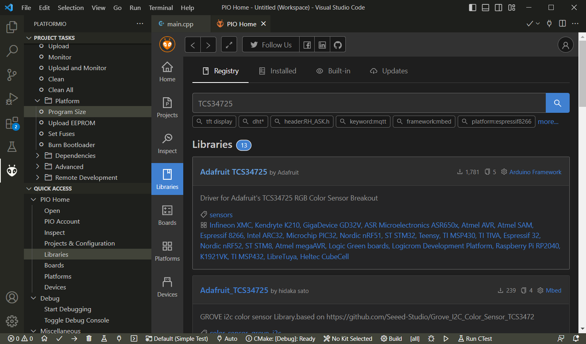
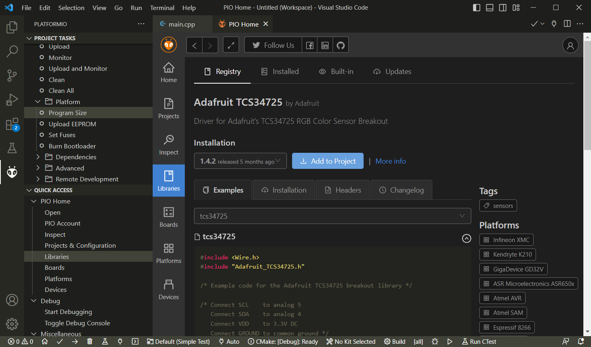
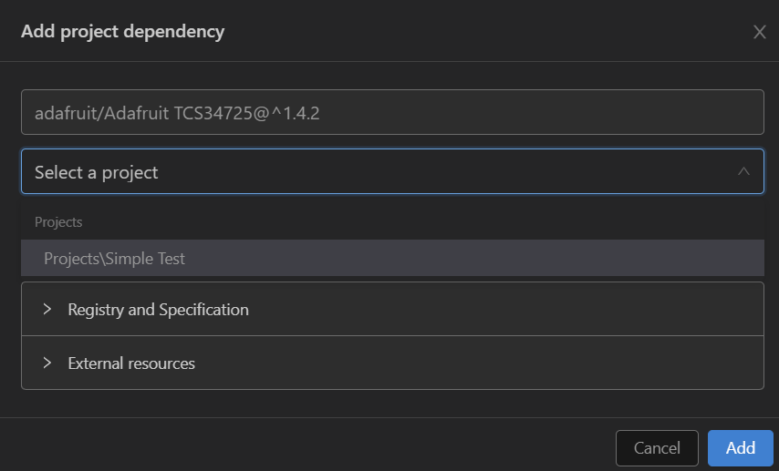
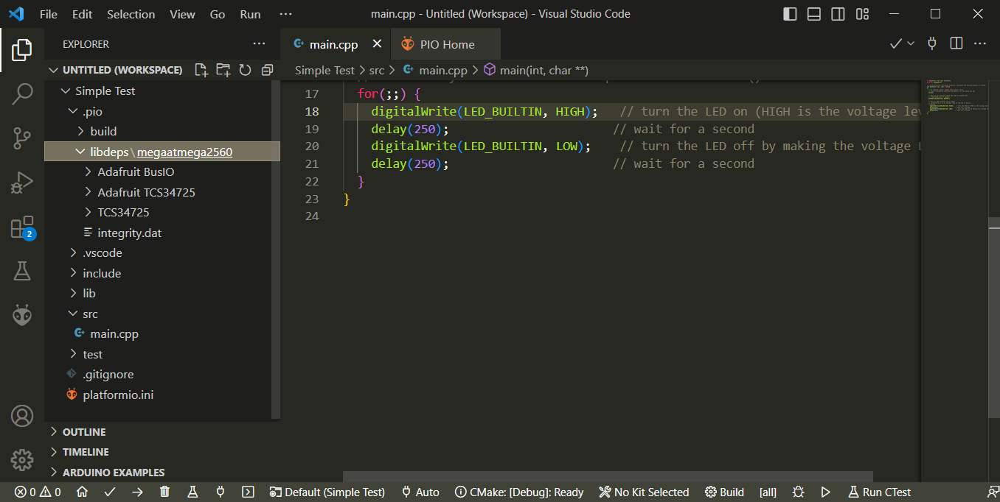

# New Library Manager

The classic *Arduino IDE* came with its own *Library Manager* that you would use to search for and install new libraries (i.e. to support new sensors or other hardware), and to maintain and update existing libraries.

## Common Place for All Libraries

*PlatformIO* comes with its own *Library Manager*. In fact, *PlatformIO* comes with its own libraries. All libraries that originally shipped with *PlatformIO* and that were added later are stored in a folder named `.platformio\packages`.

On Windows, you can open this folder in *Windows Explorer* via this *PowerShell* command:

```powershell
explorer $env:userprofile\.platformio\packages
```

<kbd></kbd>

## Packages

When you look at the contents of this folder, you see *packages* at first. The folder *framework-arduino-avr*, for example, is a package with most of the *Arduino* dependencies. When you look into this folder, you see typical contents of a *package* like these subfolders:

* **libraries**: a bunch of libraries, i.e. *Wire*, *SPI*, and *SoftwareSerial*
* **variants**: a huge collection of header files for related microcontrollers that define i.e. their respective well-known pins for analog and digital R/W etc.
* **cores**: core header files and libraries such as *Arduino.h* and *HardwareSerial.h*/*HardwareSerial.cpp*


## Searching and Installing New Libraries

Whenever you start playing with new hardware devices, one of the first things typically is to search for existing libraries that support it, and install them. 

To do this in *PlatformIO*, in *VSCode* click the big *PlatformIO* icon in the vertical icon bar on the left of the window. A tree labelled *PLATFORMIO* opens and shows a tree view. In its lower part you find a *QUICK ACCESS* section. In it, click *Libraries*.

Now a search interface opens, much similar to the classic *Arduino Library Manager*. A search field lets you search for keywords. Let's put it to work.

## Installing Support for TCS34725 Color Sensor

I'd like to use a color sensor with a *TCS34725* sensor on it. So I went ahead and created a project for it. With the project in place, I now need to find libraries that support this chip.

### Searching for Libraries

I started by entering the keyword `TCS34725`, then clicked the icon with the magnifying glass.

Almost instantly, I got back a list of matching libraries, among them the two libraries I played with before in the classic *Arduino IDE*: *Adafruit TCS34725* by *Adafruit*, and *TCS34725* by *Hideaki Tai*.

Both show as "not installed" even though I installed them previously with the classic *Arduino IDE*, emphasizing the *Arduino IDE* and *PlatformIO* use their own ecosystems for libraries (which is a good thing imho).



### Examining Libraries

When you click on a package, its details show. Details include version history but also its dependencies which is a nice thing: this way you know whether a library is stand-alone or requires a whole bunch of other libraries.




### Installing Libraries (aka: Adding Dependencies to a Project)

To install a library, click *Add to Project*. This opens one more dialog where you specify the project you want to add the library to. When you are ready to download and install, click *Add*.



The libraries you add are stored inside the selected project. They are really now *dependencies* of your project, so you can find them in the subfolder *.pio\libdeps\megaatmega2560* where *megaatmega2560* can be different, depending on the microcontroller you selected when you created the project.



### Finding Example Code


