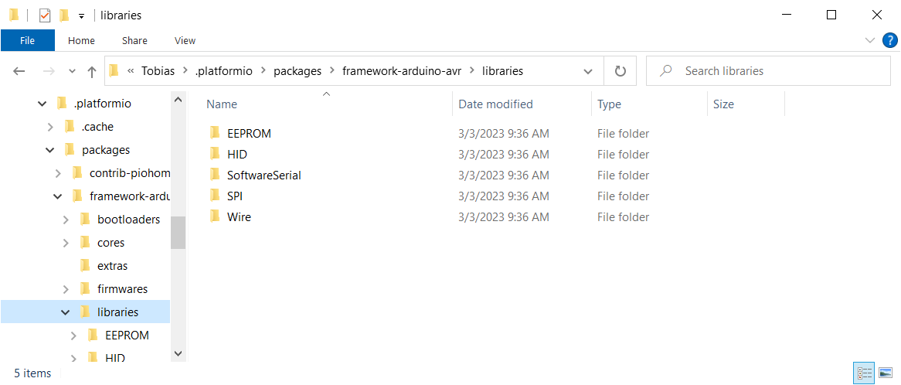

# New Library Manager

The classic *Arduino IDE* came with its own *Library Manager* that you would use to search for and install new libraries (i.e. to support new sensors or other hardware), and to maintain and update existing libraries.

*PlatformIO* comes with its own *Library Manager*. In fact, *PlatformIO* comes with its own libraries. All libraries that originally shipped with *PlatformIO* and that were added later are stored in a folder named `.platformio\packages`.

On Windows, you can open this folder in *Windows Explorer* via this *PowerShell* command:

```powershell
explorer $env:userprofile\.platformio\packages
```

<kbd></kbd>
<kbd>CTRL</kbd>
