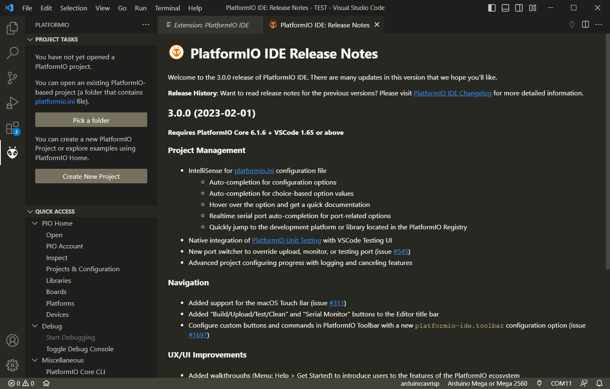
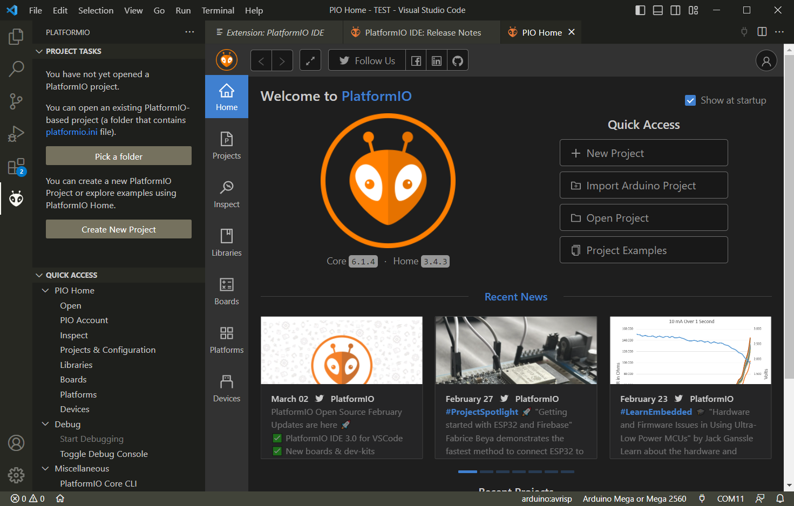
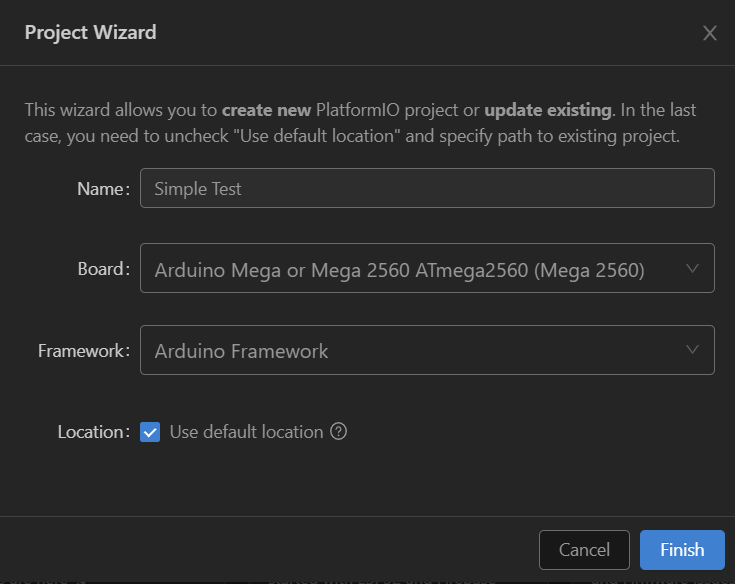
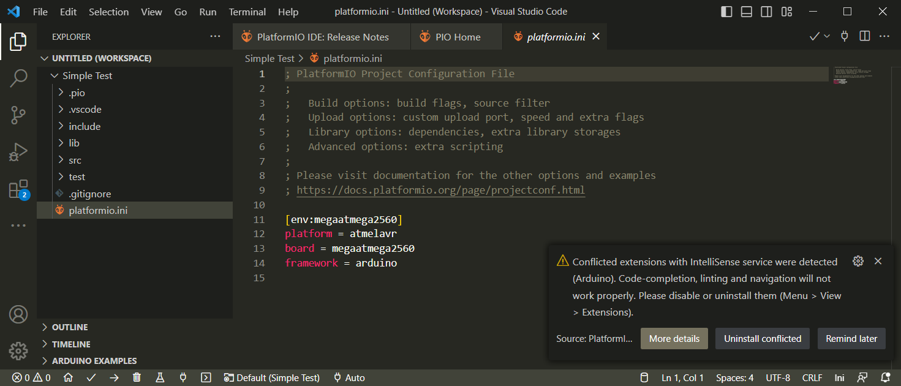
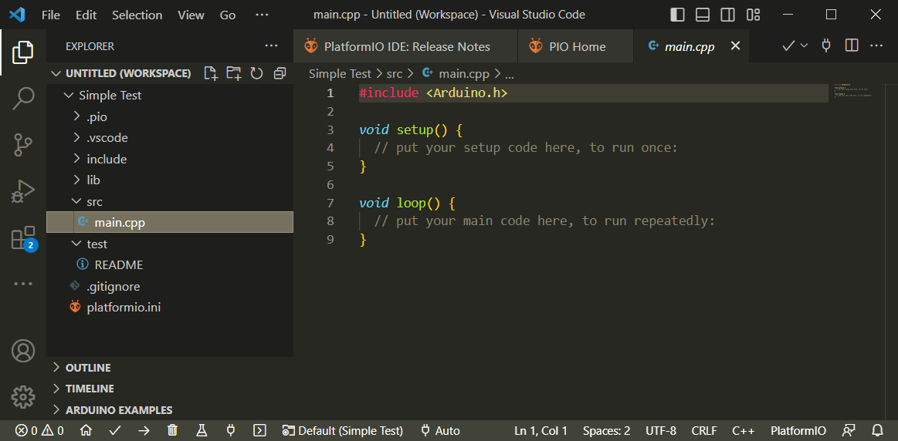
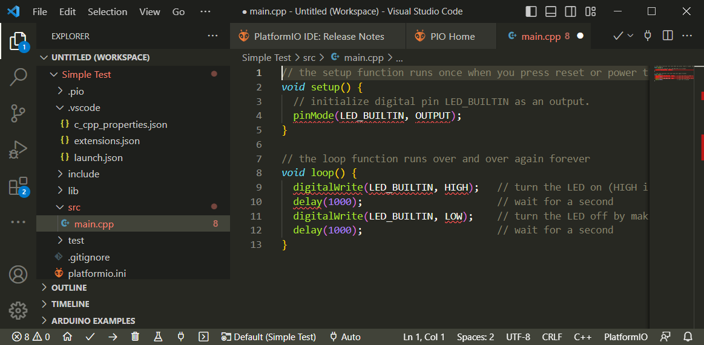

# Using VSCode for Arduino and ESP32

The "classic" Arduino IDE is severely limited when you start developing more complex code. I have been working with it for some time and found the following shortcomings especially severe:

* **IntelliSense**: There is no useful Intellisense for object members so you would need to know (or look up) the names of methods and theor overloads all the time.
* **Go To Definition**: There is no way to jump to the source code of a given member to take a peek into underlying classes to better understand code

## VSCode to the Rescue

*VSCode* is a free cross-platform generic editor from Microsoft that has excellent parsing capabilities and a great extension model. There are free extensions for just about any programming language you wish for.

In addition, these extensions often come with logic to actually run compilers, upload code, or open a serial monitor. Stand-alone, *VSCode* is just a (very capable) text editor. Combined with extensions, it turns into a full-fledged one-stop-serves-all *integrated development environment* (IDE). It can fully replace the classic Arduino IDE.

> This article will not discuss how you download and install *VSCode* or any of its extensions. There is a plethora of articles available on the Internet.

# Setting Up PlatformIO

One of the free extensions available for Arduino, ESP32 and a number of other embedded systems is **PlatformIO**. This article discusses the steps to set up this extension once you have installed it in *VSCode*.

Once the extension is installed in *VSCode*, you see a new icon in the symbol bar to the left. When you click on it, the main *PlatformIO Cockpit* page opens:



To set up the extension, simply create a first new project.

## Creating First New Project

To create a new *Project*, simply click on **New Project**. This opens up a new page. Here you can finally click on **New Project**:



This opens a dialog.

### Choose Board Type

Enter the details about your project:

* **Name**: Any name for your project. This will name the folder your code is stored in.
* **Model**: Specify the board you are using. I am using a *Arduino Mega 2560* in this example. 
* **Framework**: The available frameworks depend on the software you have installed on your machine. If you have used *Arduino* before and downloaded the official *Arduino* Software, the list contains *Arduino Framework*. We'll later discuss how you can install and use other frameworks as well, for example if you want to program *ESP32* boards.
* **Location**: By default, all projects are stored in a dedicated folder *PlatformIo\Projects* inside your *Documents* folder. You can choose a different location as well if you like.

> Start choosing the correct *model* by clicking the drop-down icon at the right end of the *Model* text field. This lists all available models. By entering any text iinto the field, the list of models is automatically filtered for you. So by entering i.e. *2560* you immediately see the available models.



Click **Finish** to set up your project. When you do this for the first time, it may take a minute. 

> Once the project folder is added to your hard drive, *VSCode* asks whether you trust this location. Click **Yes**.

PlatformIo has created a rather complex subfolder structure for your project which we'll look at next.




### Conflicting Extensions

Once your first project has been set up, *VSCode* may show a warning dialog in its lower right corner complaining about *Conflicting IntelliSense Extensions*. This happens when you have installed other extensions for *Arduino* code files before, i.e. the *Arduino* Extension from Microsoft.

The dialog can automatically uninstall conflicting extensions by clicking **Uninstall Conflicted**. 

> If you don't want to get rid of other extensions, you can also manually disable them. However, even if other extensions are disabled, *VSCode* still emits the warning dialog.

## Project Subfolder Structure

Each *PlatformIo* project consists of a folder with a number of subfolders and the file *platformio.ini*.

### platformio.ini

The file *platformio.ini* describes the attributes of your project which is essentially what you submitted when you created the project: *platform*, *board*, and *framework*. 

You do not need to touch this file unless you want to compile your code against a different board.

### Subfolder Structure

Each project folder contains these subfolders:

* **src**: This is where your *source code* sits. By default, this folder contains just one file: *main.cpp*. When you click the file, it is prefilled with the typical *Arduino* code structure.



* **include**: Here you can store header files your project depends on. Note that this is a place for *specific* header files that are part of your current project. *Generic* header files accessible to all of your projects should remain stored in the usual library folders outside your project. So typically, this folder will be emptry for simple code.
* **lib**: Similar to *include*, this is the place for *private* library files specific to your project. *Generic* library files accessible to all of your projects remain in their default library folders outside your project.
* **.pio**: Contains configuration data for *PlatformIo*, i.e. the board type(s) you use for this project. Maintained automatically for simple projects.
* **.vscode**: Local settings for *VSCode* that apply only to this particular project. 
* **test**: optionally, you can add *unit tests* and other testing to this folder to automatically detect regression errors and make sure your code is ok. Adding automatic tests is very useful for more complex code but at first you can ignore this.

## Compiling and Running Code

After setting up the project, let's now write some code, send it to *Arduino* and watch it execute the code.

I am using the basic *blink* example that blinks the built-in *Arduino* LED on the board so you don't have to set up any hardware:

```c++
// the setup function runs once when you press reset or power the board
void setup() {
  // initialize digital pin LED_BUILTIN as an output.
  pinMode(LED_BUILTIN, OUTPUT);
}

// the loop function runs over and over again forever
void loop() {
  digitalWrite(LED_BUILTIN, HIGH);   // turn the LED on (HIGH is the voltage level)
  delay(1000);                       // wait for a second
  digitalWrite(LED_BUILTIN, LOW);    // turn the LED off by making the voltage LOW
  delay(1000);                       // wait for a second
}
```

Add this code to your *main.cpp* file in the project subfolder **src**.



## Building the Code

The next step is to *build* the code: compile it and create a binary that can be uploaded to *Arduino*.

To start the build process, type `CTRL+SHIFT+P` to open the *VSCode Command Palette* input at the top of the *VSCode* window, and enter "build". This shows all available *VSCode* commands containing *build*. Choose *PlatformIO: Build*.

> If you are new to *VSCode*, you will quickly see that this editor is driven primarily through key strokes which makes it less inuitive at first. However, you do not need to remember many keyboard shortcuts. The *Command Palette* is your primary tool to discover and invoke hidden functionality. So do remember `CTRL+SHIFT+P`.


