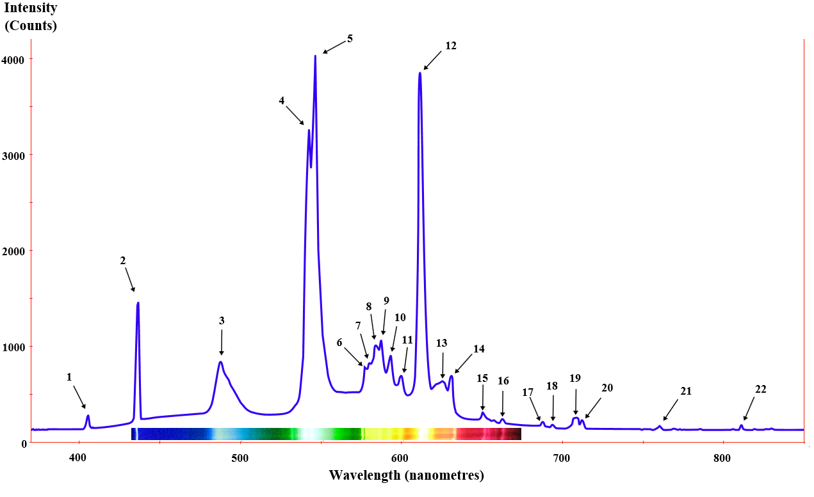

# Labeled Light Spectrum

This is a [labeled light spectrum](https://commons.wikimedia.org/wiki/File:Fluorescent_lighting_spectrum_peaks_labeled_with_colored_peaks_added.png) from a newer typical "cool white" flourescent lamp with rare-earth phosphor utilizing two rare-earth-doped phosphors, Tb3+, Ce3+:LaPO4 for green and blue emission and Eu:Y2O3 for red. 

## Labeled Peaks

In the picture, peaks are labeled

| Number | Nominal Wavelength (*nm*) | Actual Wavelength in Image (*nm*) | Element |
| :----: | :-----------------------: | :-------------------------------: | :-----: |
|1|	405.4	| 404.656 | Mercury |
|2|	436.6	|435.833 | Mercury |
|3|	487.7	|	~485-490 | Terbium |
|4|	542.4	|~543-544| Terbium |
|5|	546.5	|	546.074  | Mercury |
|6|	577.7	|576.960 | Terbium or Mercury |
|7|	580.2	|579.066 | Terbium or Mercury |
|8|	584.0	|	~580 | Terbium or Europium |
|9|	587.6	|	~587 | Europium |
|10|	593.4	|	~593 | Europium |
|11| 599.7|		~598 | Europium |
|12|	611.6	|~611 | Europium |
|13|	625.7	|	~625| Terbium |
|14|	631.1	|	~630 | Europium |
|15|	650.8	|	~650 | Europium |
|16|	662.6	|	~661 | Europium |
|17|	687.7	|~687-688 | Europium |
|18|	693.7	|	~693 | Europium |
|19|	707,709	|	~707,~709 | Europium |
|20|	712.3	|	~712 | Europium |
|21|	760.0	|	758.9315/763.5106  | Argon |
|22|	811.0	|	811.531| Argon |
