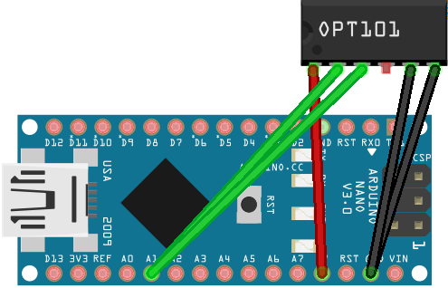

# Detecting Light Patterns for Emergency Lights

Modern emergency lights these days are LED based so there are no "physical" light patterns any more. Insteads, each vendor can create their own light patterns (blinking patterns), and most of the time these patterns aren't well documented.

Knowing these patterns can be helpful for many scenarios:

* maybe you are a model maker and would like to create realistic emergency lights for your model world
* or you'd like to create your own emergency lights from old hardware or modern vanilla LED components and would like them to match their professional counter parts
* yet again others just love the challenge

## Concept for Light Pattern Detector

Emergency lights use high frequency patterns of which some parts may last as short as 10-15 milliseconds.

A cheap photo resistor is not suitable for the task due to its latencies. What's needed is a phototransistor or a photodiode. I randomly picked a [PCB board that was readily available](https://www.google.com/search?q=CJMCU+101) and uses a [OPT101 monolithic photodiode](https://www.ti.com/lit/ds/symlink/opt101.pdf). 

You could of course reuse an old solar-cell operated calculator as well by reusing its solar cell. Really what's needed is a component that changes voltage based on light intensity, and it needs to do this with a minimum of latency.

### Using the OPT101 Breakout Board

In my tool I am going to use the [CJMCU board with OPT101 from Texas Instruments](https://www.google.com/search?q=CJMCU+101). More often than not, the board comes in parts and w/o instructions or data sheet, and you are expected to solder everything together. 

The challenging part is soldering the OPT101 chip onto the board correctly: place it on the side of the PCB that shows a square white dot (so that the soldering bridges on the PCB board are still visible and not covered by the OPT101 chip), and make sure you place the chip in such way that the (barely visible) "half-moon"-shaped recess is facing away from the PCB board pins.

### Connecting OPT101 to Arduino Nano (or similar)

